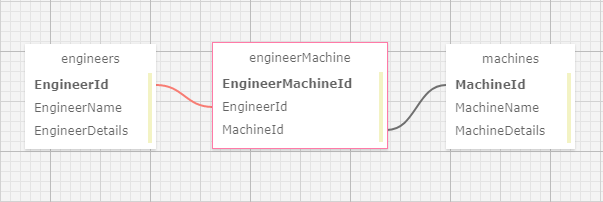

# Dr. Sillystringz's Factory: Many-To-Many Database Relationships

#### A C# application built with ASP.NET Core & Entity to integrate MySQL databases

#### By Alex Adamovic

## Technologies Used

* _C#_
* _HTML_
* _CSS_
* _MySQL_

### Dependencies

* _Entity_
* _Bootstrap_
* _ASP.NET Core_

## Description

_This C# web application, styled as an engineer / machine management portal for Dr. Sillystringz's Factory, lets a user create a list of engineers and a list of machines, utilizing a MySQL database and connecting the engineer and machine tables in Many-To-Many relationships through the use of a join table (see infographic below). From the splash page, the user is able to view all engineer and machine objects in the database, with the option to navigate between views to add, delete, view details, and edit engineers and machines for full CRUD functionality. By employing Entity and LINQ syntax, user form inputs are passed to the respective mySQL database tables through Post requests, and RESTful routes are employed with to ensure development standardization. This application is meant to showcase proper use of Many-To-Many database relationships in connecting an ASP.NET core web framework with mySQL databases using Entity._

### Database Table Structure



## Setup/Installation Requirements

#### To Install MySQL & MySQL Workbench

* _go to https://dev.mysql.com/downloads/ and install **MySQL Community Server** and **MySQL Workbench** for your operating system_
* _follow the instructions at [learnhowtoprogram](https://www.learnhowtoprogram.com/c-and-net/getting-started-with-c/installing-and-configuring-mysql) for proper installation_

#### To Set Up Project With Dependencies

* _clone repository from https://github.com/alexadamovic/Factory.Solution_
* _navigate to the project directory in your terminal/command line_
* _navigate to the subdirectory Factory and enter ```dotnet restore``` to install project dependencies_

#### To Create appsettings.json

* _navigate to the subdirectory Factory and create the file ```appsettings.json```_
* _add the following code:_
```
{
  "ConnectionStrings": {
      "DefaultConnection": "Server=localhost;Port=3306;database=[YOUR_DATABASE];uid=[YOUR_USER_ID];pwd=[YOUR_PASSWORD];"
  }
}
```
* _replace the applicable sections with your database name, your user ID, and your password_

#### To Create Database using Migrations

* _navigate to the project directory in your terminal/command line_
* _navigate to the subdirectory Factory and enter ```dotnet ef database update``` to create a new local database for the project_
* _the database will take the name specified in your ```appsettings.json``` file and can be viewed using MySQL_

#### To Run the Web Application

* _navigate to the subdirectory Factory and enter ```dotnet run``` for a snapshot server or ```dotnet watch run``` for a live updating server for the application_
* _access the server in your browser by entering ```localhost:5000``` into your navigation bar_
* _click the hyperlinks and submit forms to navigate between the views_
* _enter ```ctrl``` + ```c``` for Windows or ```command``` + ```.``` for Mac in your terminal/command line to stop the server_

## Known Bugs

* _user can instantiate multiple many-to-many relationships of the same engineer/machine combination_

## License

_MIT License_

Copyright (c) _2022_ _Alex Adamovic_

## Contact Information

alexanderadamovic@gmail.com